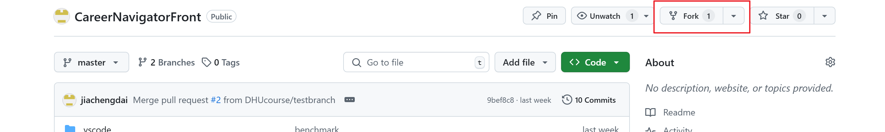
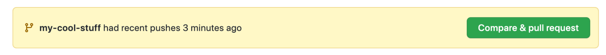
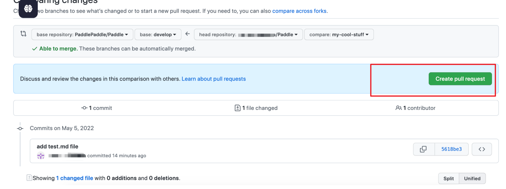

# ecms

https://github.com/tonygyf/ecms

## Git 使用说明

（1）Fork 仓库



单击 Fork 按钮，将在你的用户名下创建一个仓库副本，比如 https://github.com/你的名字/ecms


（2）将远程仓库 Clone 到本地

```
# Clone  fork的仓库到本地并进入 项目文件夹
➜  git clone https://github.com/你的名字/ecms
➜  cd ecms
```

3）创建本地分支

你需要创建一个新的分支来开发代码

```
# 创建并切换到一个名为 my-cool-staff 的分支
(my-cool-staff换成你自己的名字，下文同理)

➜ eg:  git checkout -b  my-cool-staff
```

4）编码

5）提交

```
git add .
git commit -m "一段对你修改内容的描述"
```

6）保持本地仓库最新
在向原仓库发起 Pull Request 合入代码之前，需要同步原仓库最新的代码。

首先通过 git remote 查看当前远程仓库的名字。

```
➜  git remote -v

origin    https://github.com/USERNAME/ecms (fetch)
origin    https://github.com/USERNAME/ecms (push)
```

这里命名为 origin 的远程仓库是之前 Fork 到自己用户名下的仓库。

接下来需要创建一个原始仓库的远程主机，命名为 upstream。

```
➜  git remote add upstream https://github.com/tonygyf/ecms
➜  git remote -v

origin    https://github.com/USERNAME/ecms.git (fetch)
origin    https://github.com/USERNAME/ecms.git (push)
upstream     https://github.com/tonygyf/ecms (fetch)
upstream     https://github.com/tonygyf/ecms (push)
```

获取原始仓库的最新代码并更新当前分支。

```
➜  git fetch upstream
➜  git pull upstream main
```

7）Push 到远程仓库

将本地的修改推送到 GitHub 上。如果遇到冲突问题，可以参考 GitHub 文档 来解决。

```
➜  git push origin my-cool-stuff
```

8）提交 Pull Request（PR）合入代码

打开 (https://github.com/你的名字/ecms) 页面，并切换到所建分支，然后单击 Compare & pull request 按钮。



选择目标分支:



添加必要的评论信息，然后单击 Create pull request 按钮。

### 在这里进行提交测试

@tonygyf  : Hello

@你的用户名： 随便输入内容


# 下面是我的工作部分
          
根据已有的代码分析，我将从以下几个方面详细解释登录注册相关的业务逻辑，并提供可能的答辩问题及答案：

### 1. 整体架构设计

系统采用前后端分离架构：
- 前端：Vue.js (位于ecmsvue目录)
- 后端：Spring Boot (主要业务逻辑)
- 数据库：MySQL

### 2. 登录注册核心业务逻辑

#### 2.1 后端核心组件

1. **用户服务接口**（<mcsymbol name="UserService" filename="UserService.java" path="src/main/java/com/ecms/service/UserService.java" type="interface">）
- 定义了用户管理的核心方法
- 包含登录(login)和注册(register)两个主要业务方法
- 提供了用户CRUD操作接口

2. **用户服务实现**（<mcsymbol name="UserServiceImpl" filename="UserServiceImpl.java" path="src/main/java/com/ecms/service/impl/UserServiceImpl.java" type="class">）
- 实现了具体的业务逻辑
- 包含用户名查重
- 密码处理
- 时间戳管理

3. **数据访问层**（<mcsymbol name="UserRepository" filename="UserRepository.java" path="src/main/java/com/ecms/repository/UserRepository.java" type="interface">）
- 继承JpaRepository实现数据持久化
- 提供findByUsername方法实现用户名查询

### 3. 可能的答辩问题及回答

#### 3.1 系统安全性问题

Q: 系统如何保证用户密码的安全性？
A: 目前系统的密码安全机制还比较基础，可以从以下几个方面进行加强：
1. 添加密码加密（如BCrypt）
2. 实现密码复杂度验证
3. 添加登录失败次数限制
4. 实现JWT token认证

#### 3.2 系统扩展性问题

Q: 系统如何支持未来的用户量增长？
A: 系统设计考虑了扩展性：
1. 采用分层架构，便于功能扩展
2. 使用JPA提供数据访问抽象，支持数据库扩展
3. 前后端分离架构支持独立扩展
4. 可以通过添加缓存层提升性能

#### 3.3 业务逻辑完整性

Q: 系统如何处理异常情况？
A: 系统实现了全局异常处理（<mcsymbol name="GlobalExceptionHandler" filename="GlobalExceptionHandler.java" path="src/main/java/com/ecms/exception/GlobalExceptionHandler.java" type="class">），包括：
1. 业务异常处理
2. 系统异常处理
3. 统一的错误响应格式

#### 3.4 技术选型问题

Q: 为什么选择Spring Boot + Vue.js的技术栈？
A: 
1. Spring Boot提供完整的企业级开发框架
2. Vue.js具有良好的性能和开发体验
3. 技术栈成熟，社区支持强大
4. 便于团队协作和维护

### 4. 改进建议

1. 安全性增强：
   - 添加密码加密
   - 实现登录验证码
   - 添加OAuth2认证支持

2. 功能完善：
   - 添加用户会话管理
   - 实现密码重置功能
   - 添加登录日志记录

3. 性能优化：
   - 添加缓存层
   - 实现数据库读写分离
   - 优化SQL查询

这些分析和建议可以帮助你在答辩中更好地展示系统的设计思路和技术深度。记住要强调系统的可扩展性和未来改进空间，这样可以展示你的技术视野和规划能力。

        当前模型请求量过大，请求排队约 1 位，请稍候或切换至其他模型问答体验更流畅。
